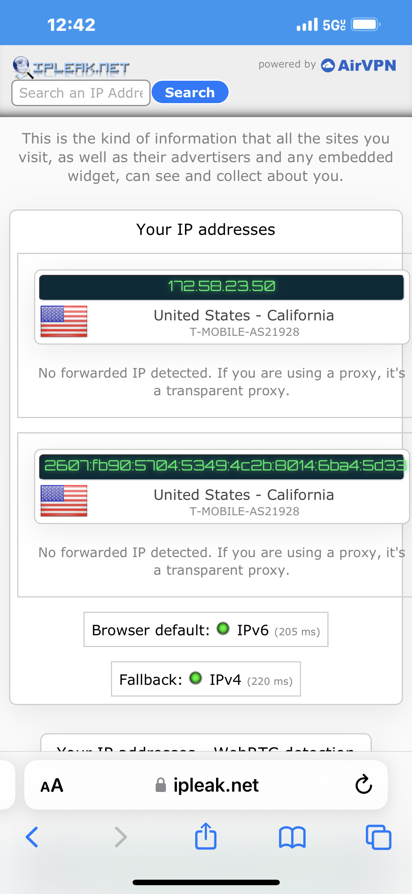

# Cloud Wireguard VPN using Docker

<details>
<summary><font size="4">Step 1: DO Account and Droplet setup</font></summary>

* Create a [DigitalOcean.com](https://www.digitalocean.com/) account
* Create an Ubuntu 22.04 Droplet
    * Ubuntu 22.04
    * Basic Shared CPU plan
    * Regular CPU option
    * Password option
</details>

<details>
<summary><font size="4">Step 2: User Setup</font></summary>

* Launch the droplet console
* ssh into root if not already in root
    * `ssh root@159.203.188.62`
* Add a new user and give user sudo permissions
    * `adduser vy`
        * Enter a password and press Enter for default values and Y for yes
    * `usermod -aG sudo vy`
* Log in as user
    * `su - vy`
</details>

<details>
<summary><font size="4">Step 3: Set up wireguard</font></summary>

* Followed [thematric.dev tutorial](https://thematrix.dev/setup-wireguard-vpn-server-with-docker/)
* `mkdir -p ~/wireguard/`
* `mkdir -p ~/wireguard/config/`
* `nano ~/wireguard/docker-compose.yml`
* Paste the following into the file
    ```
    version: '3.8'
    services:
        wireguard:
            container_name: wireguard
            image: linuxserver/wireguard
            environment:
            - PUID=1000
            - PGID=1000
            - TZ=Asia/Hong_Kong
            - SERVERURL=1.2.3.4
            - SERVERPORT=51820
            - PEERS=pc1,pc2,phone1
            - PEERDNS=auto
            - INTERNAL_SUBNET=10.0.0.0
        ports:
            - 51820:51820/udp
        volumes:
            - type: bind
                source: ./config/
                target: /config/
            - type: bind
                source: /lib/modules
                target: /lib/modules
        restart: always
        cap_add:
            - NET_ADMIN
            - SYS_MODULE
        sysctls:
            - net.ipv4.conf.all.src_valid_mark=1
    ```
* Make the following edits (or based on where you yourself are located using [this](https://en.wikipedia.org/wiki/List_of_tz_database_time_zones) link):
    * `TZ=Pacific/Honolulu`
    * `SERVERURL=159.203.188.62`
        * Insert your DO IP address
    * `PEERS=vypc1,vypc2,vyphone1`
        * Make edits to PEERS as you see fit
        * Note: do not enter non-alphanumeric characters

    

* Save and Exit
    * *CTRL + X, Y, Enter*
</details>

<details>
<summary><font size="4">Step 4: Start Wireguard</font></summary>

* `cd ~/wireguard/`
* `sudo apt install docker-compose`
* `sudo docker-compose up -d`
* You should see the message "Creating wireguard ... done"

    
</details>

<details>
<summary><font size="4">Step 5: Connecting to Wireguard on a Mobile Device</font></summary>

* Run the command `docker-compose logs -f wireguard`
* The result should be a QR codes of Wireguard VPN connection settings
* Download the Wireguard app on your mobile device
* Visit ipleak.net to see local IP info before VPN is on

    
* Open Wireguard application
* Click *+*
* Select *Create from QR Code*
* Scan the QR code for your phone setting (Ex. vyphone1)
* Turn on Wireguard VPN tunnel

    
* Visit ipleak.net to see new IP address

    
</details>

<details>
<summary><font size="4">Step 6: Connecting to Wireguard on a Laptop</font></summary>

* Use FileZilla or another file transfer application to connect to your server
* Find the configs file in `~/wireguard/configs/`
* The names of the peer folders should correspond with the names specified in the docker-compose.yml file
* Go into the appropriate peer folder
* Copy the .conf file onto your local device

    
* Download Wireguard on your laptop
* Select *Import Tunnel(s) from File...*
* Search for the file you SFTP from the server
* Import the file
* Visit ipleak.net to see local IP info before VPN is on

    
* Turn on Wireguard VPN tunnel

    
* Visit ipleak.net to see new IP address

    
</details>